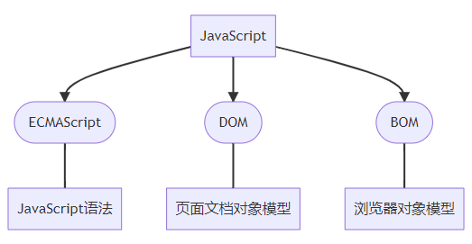
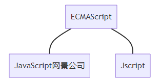

# 1 初识JavaScirpt

## 1.1 JavaScript是什么
-   JavaScript 是世界上最流行的语言之一，是一种运行在客户端的脚本语言 （Script 是脚本的意思）
-   脚本语言：不需要编译，运行过程中由 js 解释器( js 引擎）逐行来进行解释并执行
-   现在也可以基于 Node.js 技术进行服务器端编程
-  JavaScript内嵌于HTML网页中，通过浏览器内置JavaScript引擎直接编译，把一个原本只用来显示的页面，转变成支持用户交互的页面程序。

为什么交 javascript:
Unter anderem implementierte man in Netscape 2.0 eine Sprache namens LiveScript, mit der sich die Möglichkeit bot, HTML-Seiten zu beeinflussen.
Aus Gründen des Marketings wurde diese Programmiersprache später in JavaScript umbenannt, wobei sich lediglich die Syntax an Java anlehnt, jedoch sonst keine Zusammenhänge vorhanden sind.

## 1.2 JavaScript 的作用
主要用于开发交互式的Web页面，使网页的互动性更强，用户体验更好。

表单动态校验（密码强度检测） （ JS 产生最初的目的 ）
网页特效
服务端开发(Node.js)
桌面程序(Electron)
App(Cordova)
控制硬件-物联网(Ruff)
游戏开发(cocos2d-js)


## 1.3 HTML/CSS/JS 的关系
1. HTML/CSS 标记语言–描述类语言
    1. HTML 决定网页结构和内容( 决定看到什么 )，相当于人的身体
    2. CSS 决定网页呈现给用户的模样( 决定好不好看 )，相当于给人穿衣服、化妆
2. JS 脚本语言–编程类语言
    1. 实现业务逻辑和页面控制( 决定功能 )，相当于人的各种动作


## 1.4 浏览器执行JS简介

浏览器分成两部分：渲染引擎和 JS 引擎
- 渲染引擎：用来解析HTML与CSS，俗称内核，比如 chrome 浏览器的 blink ，老版本的 webkit
- JS 引擎：也称为 JS 解释器。 用来读取网页中的JavaScript代码，对其处理后运行，比如 chrome 浏览器的 V8

浏览器本身并不会执行JS代码，而是通过内置 JavaScript 引擎(解释器) 来执行 JS 代码 。JS 引擎执行代码时逐行解释每一句源码（转换为机器语言），然后由计算机去执行，所以 JavaScript 语言归为脚本语言，会逐行解释执行。


## 1.5 JS组成
JavaScript 包括 ECMAScript、DOM、BOM



1 ECMAScript
ECMAScript 是由ECMA 国际（ 原欧洲计算机制造商协会）进行标准化的一门编程语言，这种语言在万维网上应用广泛，它往往被称为 JavaScript 或 JScript，但实际上后两者是 ECMAScript 语言的实现和扩展。
ECMAScript：ECMAScript 规定了JS的编程语法和基础核心知识，是所有浏览器厂商共同遵守的一套JS语法工业标准。


2 DOM文档对象模型
文档对象模型（Document Object Model，简称DOM），是W3C组织推荐的处理可扩展标记语言的标准编程接口。通过 DOM 提供的接口可以对页面上的各种元素进行操作（大小、位置、颜色等）。

3 BOM浏览器对象模型
BOM (Browser Object Model，简称BOM) 是指浏览器对象模型，它提供了独立于内容的、可以与浏览器窗口进行互动的对象结构。通过BOM可以操作浏览器窗口，比如弹出框、控制浏览器跳转、获取分辨率等。

# 2 JavaScript的特点
1 脚本语言
脚本（script）简单来说就是一条条的文本命令，按照程序流程执行

常见的脚本语言： JavaScript、VBScript、Perl、PHP、Python等。
非脚本语言： C、C++、Java、C#等。

脚本和非脚本语言的区别
- 脚本语言依赖于解释器，只在被调用时自动进行解释或编译。
- 非脚本语言一般需要编译、链接，生成独立的可执行文件后才能运行。


2 可跨平台
几乎适用于所有的浏览器，包括手机等各类移动设备。
特点：JavaScript语言不依赖操作系统，仅需要浏览器的支持。

3 支持面向对象
面向对象是软件开发中的一种重要的编程思想，其优点非常多。


# 3 注释

1 单行注释 :  // xxx
快捷键ctrl + /

2 多行注释
快捷键 shift + alt + a

```
/*
    多行注释
*/    
```


# 4 `<noscript>`

被 noscript 包裹其中, 则 js script 中的 代码,无法对 noscript 包裹其中, 的element 起作用 

Damit so etwas nicht passiert, gibt es eine Möglichkeit, Webseiten auch für Browser ohne JavaScript zugänglich zu machen: Das HTML-Element `<noscript>` bietet Alternativmöglichkeiten an.

Und so verwenden Sie das HTML-Element:
Sie können in den `<body>`-Bereich, dorthin wo das JS-Element auftauchen sollte, das HTML-Element `<noscript>(...)</noscript>` einfügen. Dieses sorgt dafür, dass der Browser dort keine Fehlermeldung oder „gar nichts“ anzeigt, sondern das was zwischen den Tags steht.

```html
<noscript>
<p>
sdasda
</p>
</noscript>
```


# 5 断点调试
浏览器中按 F12–> sources -->找到需要调试的文件–>在程序的某一行设置断点(在行数点一下)
刷新浏览器
Watch: 监视，通过watch可以监视变量的值的变化，非常的常用
F11: 程序单步执行，让程序一行一行的执行，这个时候，观察watch中变量的值的变化

# 6 JS引入方式
JS 有3中书写位置，分别为行内、内嵌和外部

## 6.1 行内式JS
由于现代网页开发提倡结构、样式、行为的分离，即分离HTML、CSS、 JavaScript三部分的代码，避免直接写在HTML标签的属性中，从而更有利于维 护。因此在实际开发中不推荐使用行内式。

`<input type="button" value="点我试试" onclink="javascript:alert('Hello World')" />`

1.  可以将单行或少量JS代码写在HTML标签的事件属性中(以on开头的属性)，如： onclink
2.  注意单双引号的使用：在HTML中我们推荐使用**双引号**，JS中我们推荐使用**单引号**
3.  可读性差，在 HTML 中编入 JS 大量代码时，不方便阅读
4. 引号易错，引号多层嵌套匹配时，非常容易弄混
5.  特殊情况下使用

## 6.2 内嵌式JS
```javascript
<script>
     alert('Hello World!');
</script>
```


可以将多行JS代码写到`<script>`标签中
内嵌 JS 是学习时常用的方式

-  JavaScript-Programme werden sofort nach dem Laden ausgeführt
-  Ausführung beginnt mit den Anweisungen auf der globalen Ebene, Funktionen werden nur bei Aufruf ausgeführt

Im `<head>` von HTML
```html
<head>
  <meta charset="UTF-8">
  <title>JavaScript-Test</title>
  <script>
    function meineFunktion() {
      document.getElementById("meinTest").innerHTML=
        "Ein Javascript wurde ausgeführt";
    }
  </script>
</head>
<body>
  <h1>Ein Javascript bei der Ausführung</h1>
  <p id="meinTest">JavaScript testen</p>
  <button onClick="meineFunktion()">
    JavaScript Starten
  </button>
</body>
```
- JavaScript-Programm befindet sich im Header des HTML-Dokuments innerhalb des `<script>-Elements`
- Problem: bei großen Webseiten wird das JavaScript gestartet bevor die Webseite komplett gerendert is


Im `<Body>` von HTML
```html
<head>
  <meta charset="UTF-8">
  <title>JavaScript-Test</title>
</head>
<body>
  <h1>Ein Javascript bei der Ausführung</h1>
  <p id="meinTest">JavaScript testen</p>
  <button onClick="meineFunktion()">
    JavaScript Starten
  </button>
  <script>
    function meineFunktion() {
      document.getElementById("meinTest").innerHTML=
        "Ein Javascript wurde ausgeführt";
    }
  </script>
</body>
```
- JavaScript-Programm befindet sich im Body des HTML-Dokuments innerhalb des `<script>`-Elements
- JavaScript wird zuletzt geladen, wenn Webseite fast fertig gerendert ist

## 6.3 外部JS

放入 `</head> ` 中
```js
<script src="my.js"></script>
<script src="00types.js" defer async></script>
```

```html
<!DOCTYPE html>

<html lang="de">
<head>
  <meta charset="utf-8">
  <title>load js</title>
  <link rel="stylesheet" href="myStyles.css">
  <script src="myScript.js defer async></script>
</head>
```

利于HTML页面代码结构化，把单独JS代码独立到HTML页面之外，既美观，又方便
引用外部JS文件的script标签中间不可以写代码
适合于JS代码量比较大的情况


---

Einbindung des JavaScript-Programms als externe Datei im Header oder im Body
Oftmals eine einzelne JavaScript-Datei für alle Webseiten einer Website

```html
<head>
  <meta charset="UTF-8">
  <title>JavaScript-Test</title>
</head>
<body>
  <h1>Ein Javascript bei der Ausführung</h1>
  <p id="meinTest">JavaScript testen</p>
  <button onClick="meineFunktion()">
    JavaScript Starten
  </button>
  <script src="js/meinScript.js"></script>
</body>
```

```js
function meineFunktion() {
  document.getElementById("meinTest").innerHTML=
    "Ein JavaScript wurde ausgeführt!";
};
```


# 7 引入方式: die Attribute defer und async
https://www.mediaevent.de/javascript/programm-struktur.html

1. Externe Scripte werden mit async asynchron – parallel zu anderen Ressourcen – geladen. 
2. defer verspricht dem Browser, dass die Webseite nicht durch Anweisungen wie document.write geändert wird.


## 7.1 Ablauf
Der Browser interpretiert das HTML-Dokument Zeile für Zeile. Steht das script-Tag im head-Tag der Seite, wird der Browser das Javascript an Ort und Stelle ausführen.


### 7.1.1 将 js script 放入 head 中出现的问题

Die meisten Funktionen können allerdings erst ausgeführt werden, wenn bestimmte Elemente der Webseite geladen sind. Der Browser muss die angesprochenen Elemente bereits geladen haben, sonst entsteht ein Javascript-Fehler.
Wenn es gute Gründe gibt, Javascript bereits im head zu laden, rangiert das Script nach den CSS-Dateien.


```html
<html lang="de">
<head>
   <title>Wohin mit dem script-Tag?</title>
   <link media="screen" href="style.css">
   <script>
      let header = querySelector ('header'); <-- Fehlermeldung
   </script>                                        |
</head>                                             |
<body>                                              |
   <header>           existiert erst hier <---------+
       …
   </header>
</body>
</html>
```

如何解决这个问题
Die Ausführung des Scripts muss mit onload oder addEventListener unterbrochen und zurückgestellt werden, bis das Dom geladen ist und durchquert werden kann.
```js
<head>
   <script>
      window.addEventListener ('load', function () {
         let header = querySelector ('header');
      });
   </script>
</head>
<body>
   <header>
       …
   </header>
</body>
```

Die Logik für das Anhalten des Scripts und das Registrieren des Events, bei dem das Script fortgesetzt werden soll, ist kompliziert. In der Vergangenheit musste das Javascript darum zu wilden Konstruktionen greifen.

### 7.1.2 将 js script 放入 html 末端 不会出现问题

Es ist einfacher, das Script am Ende der HTML-Seite vor dem schließenden body-Tag unterzubringen. Die generelle Regel lautet:
CSS-Dateien im head, Javascript am Ende der Webseite einbinden.


```html
<html lang="de">
<head>
   …
</head>
<body>
   <div id="header"> … </div>
   
   <script src="/jquery.min.js"></script>
   <script>
      alert ("Hallo World!");
      document.getElementById("header");
   </script>
</body>
</html>
```

## 7.2 async and  defer

### 7.2.1 Script ohne async / defer laden 会出现的问题

Auch wenn das Script am Ende der Seite geladen wird und selbst wenn die Seite bereits im Browser gerendert ist, kann der Benutzer vor dem Laden und Interpretieren des Scripts nicht auf Links zugreifen und nicht scrollen.


### 7.2.2 Script asynchron laden的优势

Aufbau der Seite的时候, 有html 相关的元素出现,  Browser就同时开始 laden das 相关的Script. 
- zuerst geladen zuerst ausgeführt
优点是:  kürzt die Ladezeit und das Script kann sofort ausgeführt werden.

Mit _async_ lädt der Browser das Script parallel zu anderen Ressourcen und beginnt derweil mit dem Aufbau der Seite. <mark>Sobald das Script geladen ist, entsteht eine Pause, weil der Browser das Script erst interpretieren muss.</mark>

Vorzugsweise sollten externe Scripts asynchron geladen werden. 
Für Third Party-Scripte ist _async_ ein Muss – wenn deren Server gerade in die Knie geht, zieht das Script die eigene Seite in den Abgrund. 深渊
Das asynchrone Laden von externen Scripten kürzt die Ladezeit und das Script kann sofort ausgeführt werden.

async kann aber auch ein Dilemma sein (进退两难), denn es ist nicht vorhersehbar, wann das Script tatsächlich geladen und ausführbar ist.


### 7.2.3 Laden mit defer verzögern的优势

Aufbau der Seite的最后, 等到其他komponenten都被 laden 完成,  Browser才开始 laden das Script 

Das [defer-Attribut im script-Tag](https://www.mediaevent.de/html/script.html) verspricht dem Browser, dass die Webseite nicht durch Anweisungen wie _document.write_ (was sowieso unerwünscht ist) geändert wird. 
<mark>Der Browser verschiebt das Laden und Ausführen des Scripts, bis alle anderen Komponenten geladen und die Seite geparst ist.</mark>

Es ist nicht einfach vorauszusehen, wann das Script tatsächlich vollständig geladen ist. Theoretisch sollte das der Fall sein, sobald das DOM geladen ist, direkt bevor [_DOMContentLoaded_](https://www.mediaevent.de/javascript/dom-content-loaded.html "dom content loaded") feuert.

Die Ladezeit der Seite wird immer noch durch das Laden des Scripts verlängert. Der Benutzer kann Links noch nicht benutzen und noch nicht scrollen.


### 7.2.4 DOMContentLoaded mit defer / async
优点是 Scripte 不会阻碍 Rendern der Seite

Sowohl async als auch defer weisen den Browser an, die Seite zu laden und aufzubauen, und die Scripte im Hintergrund auszuführen. Die Scripte sollen den Aufbau des DOM und das Rendern der Seite nicht blockieren.

|async|defer|
|---|---|
|Mit async führt der Browser Scripte in der Reihenfolge zuerst geladen zuerst ausgeführt aus. Das zuerst geladene Script läuft zuerst, egal an welcher Stelle das Script im DOM erscheint.|Mit defer führt der Browser die Script in der Reihenfolge aus, in der sie aufgeführt sind.|
|Scripte mit async können geladen und ausgeführt werden während das Dokument noch nicht vollständig geladen wurde, etwa wenn das Script klein oder im Cache ist und das Dokument lang genug.|Scripts mit defer müssen warten, bis das Dokument geladen und geparst ist, also bis DOMContentLoaded.|


## 7.3 Script Insertion
某些 Javascript 中的 东西, 对于某个 html 的render 并不需要.  这一部分的东西 (in java script), 会在 所有的东西 都被加载后,才会被加在 
Wenn Javascript nicht für den Aufbau der Seite benötigt wird, muss ein externes Script erst geladen werden, wenn das DOM und alle Elemente geladen sind.


Mit _async_ ist _Script Insertion_ im Grunde genommen überflüssig geworden.
Dafür sorgen ein paar Zeilen Javascript am Ende der Seite.


Javascript nachladen
```js
function loadScriptAfter() {
   let script = document.createElement("script");
   script.src = "script.js";
   document.body.appendChild(script);
}

if (window.addEventListener) {
   window.addEventListener("load", loadScriptAfter);
} else if (window.attachEvent) {
   window.attachEvent("onload", loadScriptAfter);
} else {
   window.onload = loadScriptAfter;
}

```


## 7.4 Ladezeiten verkürzen

Das Auslagern von Javascript in eine externe Scriptdatei kann die Performance von Webseiten verbessern. Wenn die Scripte auf mehreren Webseiten eingesetzt werden, liegen die Scripte beim Aufrufe einer weiteren Seite bereits im Cache des Browsers.

Wenn Design und Entwicklung der Webseite abgeschlossen sind, wurden früher externe Javascript-Dateien so weit wie möglich zu einer Script-Datei zusammengeführt. Weniger HTTP-Requests – das reduziert die Ladezeit.

Mit HTTP/2 fällt diese Optimierung weniger ins Gewicht, zudem hat uns ECMAScript 6 den [Export und Import von Script-Dateien als Module](https://www.mediaevent.de/javascript/import-export.html) mitgebracht.


# 8 Die Javascript-Laufzeitumgebung im Browser


