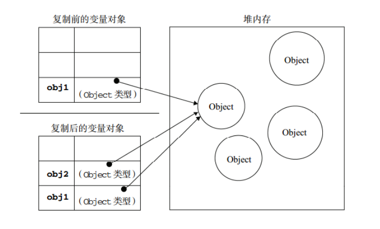

https://blog.fundebug.com/2017/08/09/explain_value_reference_in_js/

# 1 总览
简单类型又叫做基本数据类型或者值类型，复杂类型又叫做引用类型。

值类型：string ，number，boolean，undefined，null
- 简单数据类型/基本数据类型，在存储时变量中存储的是值本身，因此叫做值类型, 这些基本类型在赋值的时候是通过值传递的方式
- 当为变量引用基本类型的值时，实际上会拷贝一个值副本给新的变量，引用相同基本类型值的变量相互独立，如下图:


引用类型：复杂数据类型，在存储时变量中存储的仅仅是地址（引用），因此叫做引用数据类型, 它们通过引用来传递。
- 通过 new 关键字创建的对象（系统对象、自定义对象），如 Object、Array、Date等
- 

# 2 堆和栈
堆栈空间分配区别：

栈（操作系统）：由操作系统自动分配释放存放函数的参数值、局部变量的值等。其操作方式类似于数据结构中的栈；
- 简单数据类型存放到栈里面

堆（操作系统）：存储复杂类型(对象)，一般由程序员分配释放，若程序员不释放，由垃圾回收机制回收。
- 复杂数据类型存放到堆里面


注意：<mark>JavaScript中没有堆栈的概念</mark>，通过堆栈的方式，可以让大家更容易理解代码的一些执行方式，便于将来学习其他语言。


# 3 内存分配
值类型（简单数据类型）： string ，number，boolean，undefined，null
值类型变量的数据直接存放在变量（栈空间）中


引用类型（复杂数据类型）：通过 new 关键字创建的对象（系统对象、自定义对象），如 Object、Array、Date等
引用类型变量（栈空间）里存放的是地址，真正的对象实例存放在堆空间中


```html
<script>
    // 简单数据类型 null  返回的是一个空的对象  object 
    var timer = null;
    console.log(typeof timer);
    // 如果有个变量我们以后打算存储为对象，暂时没想好放啥， 这个时候就给 null 
    // 1. 简单数据类型 是存放在栈里面 里面直接开辟一个空间存放的是值
    // 2. 复杂数据类型 首先在栈里面存放地址 十六进制表示  然后这个地址指向堆里面的数据
</script>
```

# 4 值传递 (值类型使用的方法)

如果一个基本的数据类型绑定到某个变量，我们可以认为该变量包含这个基本数据类型的值。
当我们使用=将这些变量赋值到另外的变量，实际上是将对应的值拷贝了一份，然后赋值给新的变量。我们把它称作值传递。

var x = 10;
var y = "abc";

var a = x;
var b = y;

console.log(x, y, a, b); // 10, 'abc', 10, 'abc'

a和x都包含 10，b和y都包含'abc'，并且它们是完全独立的拷贝，互不干涉。如果我们将a的值改变，x不会受到影响。
var x = 10;
var y = "abc";
var a = x;
var b = y;
a = 5;
b = "def";
console.log(x, y, a, b); // 10, 'abc', 5, 'def'


# 5 引用传递 (引用类型使用的方法)

## 5.1 对象
如果一个变量绑定到一个非基本数据类型(Array, Function, Object)，那么它只记录了一个内存地址，该地址存放了具体的数据。注意之前提到指向基本数据类型的变量相当于包含了数据，而现在指向非基本数据类型的变量本身是不包含数据的。

对象在内存中被创建，当我们声明arr = []，我们在内存中创建了一个数组。arr记录的是该内存的地址。
var arr = []; // (a)
arr.push(1); // (b)

当执行完(a)之后，内存中创建了一个空的数组对象，其内存地址为#001，arr指向该地址。
变量	地址	对象
arr	#001	[]

当执行完(b)之后，数组对象中多了一个元素，但是数组的地址依然没有变，arr也没有变。
变量	地址	对象
arr	#001	[1]

## 5.2 引用传递
对象是通过引用传递，而不是值传递。也就是说，变量赋值只会将地址传递过去。
var reference = [1];
var refCopy = reference;

变量	地址	对象
reference	#001	[1]
refCopy	#001


reference和refCopy指向同一个数组。 如果我们更新reference，refCopy也会受到影响。
reference.push(2);
console.log(reference, refCopy); // [1, 2], [1, 2]
变量	地址	对象
reference	#001	[1, 2]
refCopy	#001

## 5.3 引用重新赋值
如果我们将一个已经赋值的变量重新赋值，那么它将包含新的数据或则引用地址。

obj从指向第一个对象变为指向第二个对象。
var obj = { first: "fundebug.com" };
obj = { second: "fundebug.cn" };

变量	地址	对象
obj	#001	{first: ‘fundebug.com’}
obj   #002	{second: ‘fundebug.cn’}
如果一个对象没有被任何变量指向，就如第一个对象(地址为#001)，JavaScript 引擎的垃圾回收机制会将该对象销毁并释放内存。


## 5.4 == 和 ===
对于引用类型的变量，`==和===` 只会判断引用的地址是否相同，而不会判断对象具体里属性以及值是否相同。因此，如果两个变量指向相同的对象，则返回true。

var arrRef = ["Hi!"];
var arrRef2 = arrRef;
console.log(arrRef === arrRef2); // true

如果是不同的对象，及时包含相同的属性和值，也会返回false。
var arr1 = ["Hi!"];
var arr2 = ["Hi!"];
console.log(arr1 === arr2); // false

如果想判断两个不同的对象是否真的相同，一个简单的方法就是将它们转换为字符串然后判断。
var arr1str = JSON.stringify(arr1);
var arr2str = JSON.stringify(arr2);
console.log(arr1str === arr2str); // true

另一个方法就是递归地判断每一个属性的值，直到基本类型位置，然后判断是否相同。

# 6 函数中_值类型传参_引用类型传参

## 6.1 值类型传参
函数的形参也可以看做是一个变量，当我们把一个值类型变量作为参数传给函数的形参时，其实是把变量在栈空间里的值复制了一份给形参，那么在方法内部对形参做任何修改，都不会影响到的外部变量。

```html
<script>
    // 简单数据类型传参
    function fn(a) {
        a++;
        console.log(a);
    }
    var x = 10;
    fn(x);
    console.log(x);
</script>

```


当我们将基本类型数据传入函数，函数会将这些数据拷贝赋值给函数的参数变量。
```js
var hundred = 100;
var two = 2;
function multiply(x, y) {
    return x * y;
}
var twoHundred = multiply(hundred, two);
```

hundred的值拷贝给变量x，two的值拷贝给变量y。

## 6.2 引用类型传参
函数的形参也可以看做是一个变量，当我们把引用类型变量传给形参时，其实是把变量在栈空间里保存的堆地址复制给了形参，形参和实参其实保存的是同一个堆地址，所以操作的是同一个对象。

```html
<script>
    // 复杂数据类型传参
    function Person(name) {
        this.name = name;
    }

    function f1(x) { // x = p
        console.log(x.name); // 2. 这个输出什么 ?  刘德华   
        x.name = "张学友";
        console.log(x.name); // 3. 这个输出什么 ?   张学友
    }
    var p = new Person("刘德华");
    console.log(p.name); // 1. 这个输出什么 ?   刘德华 
    f1(p);
    console.log(p.name); // 4. 这个输出什么 ?   张学友
</script>
```

### 6.2.1 纯函数
对于一个函数，给定一个输入，返回一个唯一的输出。除此之外，不会对外部环境产生任何附带影响。我们机会称该函数为纯函数。所有函数内部定义的变量在函数返回之后都被垃圾回收掉。

但是，如果函数的输入是对象(Array, Function, Object)，那么传入的是一个引用。对该变量的操作将会影响到原本的对象。这样的编程手法将产生附带影响，是的代码的逻辑复杂和可读性变低。

因此，很多数组函数，比如Array.map和Array.filter是以纯函数的形式实现。虽然它们的参数是一个数组变量，但是通过深度拷贝并赋值给一个新的变量，然后在新的数组上操作，来防止原始数组被更改。

我们来看一个例子：
```js
function changeAgeImpure(person) {
    person.age = 25;
    return person;
}
var alex = {
    name: "Alex",
    age: 30
};
var changedAlex = changeAgeImpure(alex);
console.log(alex); // { name: 'Alex', age: 25 }
console.log(changedAlex); // { name: 'Alex', age: 25 }
在非纯函数changeAgeImpure中，将对象person的age更新并返回。原始的alex对象也被影响，age更新为 25。
```


让我们来看如何实现一个纯函数：
```js
function changeAgePure(person) {
    var newPersonObj = JSON.parse(JSON.stringify(person));
    newPersonObj.age = 25;
    return newPersonObj;
}
var alex = {
    name: "Alex",
    age: 30
};
var alexChanged = changeAgePure(alex);
console.log(alex); // { name: 'Alex', age: 30 }
console.log(alexChanged); // { name: 'Alex', age: 25 }
```

我们通过JSON.sringify将对象变为一个字符串，然后再通过JSON.parse将字符串变回对象。通过该操作会生成一个新的对象。
