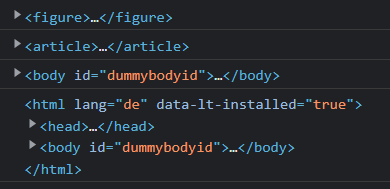
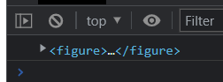

# 1 事件基础


## 1.1 事件概述
JavaScript 使我们有能力创建动态页面，而事件是可以被 JavaScript 侦测到的行为。

简单理解： 触发— 响应机制。

网页中的每个元素都可以产生某些可以触发 JavaScript 的事件，例如，我们可以在用户点击某按钮时产生一个事件，然后去执行某些操作。

## 1.2 事件三要素
事件源(谁)
事件类型(什么事件)
事件处理程序(做啥)

```html
<script>
    // 点击一个按钮，弹出对话框
    // 1. 事件是有三部分组成  事件源  事件类型  事件处理程序   我们也称为事件三要素
    //(1) 事件源 事件被触发的对象   谁  按钮
    var btn = document.getElementById('btn');
    //(2) 事件类型  如何触发 什么事件 比如鼠标点击(onclick) 还是鼠标经过 还是键盘按下
    //(3) 事件处理程序  通过一个函数赋值的方式 完成
    btn.onclick = function() {
        alert('点秋香');
    }
</script>
```


## 1.3 执行事件的步骤
获取事件源
注册事件(绑定事件)
添加事件处理程序(采取函数赋值形式)
```js
<script>
    // 执行事件步骤
    // 点击div 控制台输出 我被选中了
    // 1. 获取事件源
    var div = document.querySelector('div');
    // 2.绑定事件 注册事件
    // div.onclick 
    // 3.添加事件处理程序 
    div.onclick = function() {
        console.log('我被选中了');
    }
</script>
```


# 2 DOM事件流 / Event Propagation Reihenfolge
- 事件流描述的是从页面中接收事件的顺序
- 事件发生时会在元素节点之间按照特定的顺序传播，这个传播过程即DOM事件流


事件冒泡： IE 最早提出，事件开始时由最具体的元素接收，然后逐级向上传播到到 DOM 最顶层节点的过程。
事件捕获： 网景最早提出，由 DOM 最顶层节点开始，然后逐级向下传播到到最具体的元素接收的过程。
加深理解： 我们向水里面扔一块石头，首先它会有一个下降的过程，这个过程就可以理解为从最顶层向事件发生的最具体元素（目标点）的捕获过程；之后会产生泡泡，会在最低点（ 最具体元素）之后漂浮到水面上，这个过程相当于事件冒泡。


## 2.1 捕获阶段/ capture phase
document -> html -> body -> father -> son
两个盒子嵌套，一个父盒子一个子盒子，我们的需求是当点击父盒子时弹出 father ，当点击子盒子时弹出 son
```html
<body>
    <div class="father">
        <div class="son">son盒子</div>
    </div>
    <script>
        // dom 事件流 三个阶段
        // 1. JS 代码中只能执行捕获或者冒泡其中的一个阶段。
        // 2. onclick 和 attachEvent（ie） 只能得到冒泡阶段。
        // 3. 捕获阶段 如果addEventListener 第三个参数是 true 那么则处于捕获阶段  document -> html -> body -> father -> son
        var son = document.querySelector('.son');
        son.addEventListener('click', function() {
             alert('son');
        }, true);
        var father = document.querySelector('.father');
        father.addEventListener('click', function() {
            alert('father');
        }, true);
    </script>
</body>
```


但是因为DOM流的影响，我们点击子盒子，会先弹出 father，之后再弹出 son


这是因为捕获阶段由 DOM 最顶层节点开始，然后逐级向下传播到到最具体的元素接收
- document -> html -> body -> father -> son
- 先看 document 的事件，没有；再看 html 的事件，没有；再看 body 的事件，没有；再看 father 的事件，有就先执行；再看 son 的事件，再执行。

## 2.2 冒泡阶段/ Bubble phase 
son -> father ->body -> html -> document

我们点击子盒子，会弹出 son、father、document
这是因为冒泡阶段开始时由最具体的元素接收，然后逐级向上传播到到 DOM 最顶层节点
son -> father ->body -> html -> document
```html
<body>
    <div class="father">
        <div class="son">son盒子</div>
    </div>
    <script>
		// 4. 冒泡阶段 如果addEventListener 第三个参数是 false 或者 省略 那么则处于冒泡阶段  son -> father ->body -> html -> document
        var son = document.querySelector('.son');
        son.addEventListener('click', function() {
            alert('son');
        }, false);
        var father = document.querySelector('.father');
        father.addEventListener('click', function() {
            alert('father');
        }, false);
        document.addEventListener('click', function() {
            alert('document');
        })
    </script>
</body>
```


## 2.3 小结
- JS 代码中只能执行捕获或者冒泡其中的一个阶段
- onclick 和 attachEvent只能得到冒泡阶段
- addEventListener(type,listener[,useCapture])第三个参数
    - 如果是 true，表示在事件捕获阶段调用事件处理程序；
    - 如果是 false (不写默认就是false),表示在事件冒泡阶段调用事件处理程序
- 实际开发中我们很少使用事件捕获，我们更关注事件冒泡。
- 有些事件是没有冒泡的，比如 onblur、onfocus、onmouseenter、onmouseleave


# 3 事件对象
```js
eventTarget.onclick = function(event) {
   // 这个 event 就是事件对象，我们还喜欢的写成 e 或者 evt 
} 
eventTarget.addEventListener('click', function(event) {
   // 这个 event 就是事件对象，我们还喜欢的写成 e 或者 evt  
})
```


官方解释：event 对象代表事件的状态，比如键盘按键的状态、鼠标的位置、鼠标按钮的状态

简单理解：
事件发生后，跟事件相关的一系列信息数据的集合都放到这个对象里面
这个对象就是事件对象 event，它有很多属性和方法，比如“
- 谁绑定了这个事件
- 鼠标触发事件的话，会得到鼠标的相关信息，如鼠标位置
- 键盘触发事件的话，会得到键盘的相关信息，如按了哪个键
这个 event 是个形参，系统帮我们设定为事件对象，不需要传递实参过去
当我们注册事件时， event 对象就会被系统自动创建，并依次传递给事件监听器（事件处理函数）

```html
<body>
    <div>123</div>
    <script>
        // 事件对象
        var div = document.querySelector('div');
        div.onclick = function(e) {
                // console.log(e);
                // console.log(window.event);
                // e = e || window.event;
                console.log(e);


            }
        // 1. event 就是一个事件对象 写到我们侦听函数的 小括号里面 当形参来看
        // 2. 事件对象只有有了事件才会存在，它是系统给我们自动创建的，不需要我们传递参数
        // 3. 事件对象 是 我们事件的一系列相关数据的集合 跟事件相关的 比如鼠标点击里面就包含了鼠标的相关信息，鼠标坐标啊，如果是键盘事件里面就包含的键盘事件的信息 比如 判断用户按下了那个键
        // 4. 这个事件对象我们可以自己命名 比如 event 、 evt、 e
        // 5. 事件对象也有兼容性问题 ie678 通过 window.event 兼容性的写法  e = e || window.event;
    </script>
</body>
```

### 3.1.1 事件对象的兼容性方案
事件对象本身的获取存在兼容问题：
标准浏览器中是浏览器给方法传递的参数，只需要定义形参 e 就可以获取到。
在 IE6~8 中，浏览器不会给方法传递参数，如果需要的话，需要到 window.event 中获取查找
解决：
`e = e || window.event;`

```html
<body>
    <div>123</div>
    <script>
        // 事件对象
        var div = document.querySelector('div');
        div.onclick = function(e) {
                // e = e || window.event;
                console.log(e);
				// 事件对象也有兼容性问题 ie678 通过 window.event 兼容性的写法  e = e || window.event;

            }
</body>
```


### 3.1.2 事件对象的常见属性和方法
|事件对象属性方法|	说明|
|--|---|
|e.target	|返回触发事件的对象 标准|
|e.srcElement	|返回触发事件的对象 非标准 ie6-8使用|
|e.type	|返回事件的类型 比如click mouseover 不带on|
|e.cancelBubble	|该属性阻止冒泡，非标准，ie6-8使用|
|e.returnValue	|该属性阻止默认行为 非标准，ie6-8使用|
|e.preventDefault()	|该方法阻止默认行为 标准 比如不让链接跳转|
|e.stopPropagation()	|阻止冒泡 标准|

### 3.1.3 e.target

```js
1
let submit = document.querySelector("[type=submit]");
submit.addEventListener("click",
    function (e) {
        e.preventDefault();
    },
    false);


2
let form = document.forms[0];

form.addEventListener("blur",
    function (e) {
        console.log(e.target);
        let error = e.target.validity;
        console.log(error);
        console.log(error.valid);

        if (error) {
            //Fehlermeldung schicken und Feld übergeben
            console.log(hasError(e.target));
        }
        if (error.valid) // 当全部的 feld 检验都正确了 
            deleteMessage();  // 这是一个自定义的function 
    },
    // propagation umkehren
    true);
```

#### 3.1.3.1 e.target 和 this 的区别
this 是事件绑定的元素， 这个函数的调用者（绑定这个事件的元素）
e.target 是事件触发的元素。


this是事件绑定的元素，这个函数的调用者(绑定这个事件的元素)
e.target是事件触发的元素

```html
<body>
    <div>123</div>
    <ul>
        <li>abc</li>
        <li>abc</li>
        <li>abc</li>
    </ul>
    <script>
        // 常见事件对象的属性和方法
        // 1. e.target 返回的是触发事件的对象（元素）  this 返回的是绑定事件的对象（元素）
        // 区别 ： e.target 点击了那个元素，就返回那个元素 this 那个元素绑定了这个点击事件，那么就返回谁
        var div = document.querySelector('div');
        div.addEventListener('click', function(e) {
            console.log(e.target);
            console.log(this);

        })
        var ul = document.querySelector('ul');
        ul.addEventListener('click', function(e) {
                // 我们给ul 绑定了事件  那么this 就指向ul  
                console.log(this);
                console.log(e.currentTarget);

                // e.target 指向我们点击的那个对象 谁触发了这个事件 我们点击的是li e.target 指向的就是li
                console.log(e.target);

            })
            // 了解兼容性
            // div.onclick = function(e) {
            //     e = e || window.event;
            //     var target = e.target || e.srcElement;
            //     console.log(target);

        // }
        // 2. 了解 跟 this 有个非常相似的属性 currentTarget  ie678不认识
    </script>
</body>

```


# 4 常见的鼠标事件
|鼠标事件	|触发条件|
|--|---|
|onclick	|鼠标点击左键触发|
|onmouseover	|鼠标经过触发|
|onmouseout	|鼠标离开触发|
|onfocus	|获得鼠标焦点触发|
|onblur	|失去鼠标焦点触发|
|onmousemove	|鼠标移动触发|
|onmouseup	|鼠标弹起触发|
|onmousedown	|鼠标按下触发|

新的写法

|鼠标事件	|触发条件|
|--|--- |
|click	|鼠标点击左键触发|
|mouseover	|鼠标经过触发|
|mouseout	|鼠标离开触发|
|focus	|获得鼠标焦点触发|
|blur	|失去鼠标焦点(就是 鼠标离开这个 feld 了) 的时候 触发|
|mousemove	|鼠标移动触发|
|mouseup	|鼠标弹起触发|
|mousedown	|鼠标按下触发|
|change|it doesn't fire unnecessarily when the user clicks an already-selected radio.|
| formdata | The formdata event fires after the entry list representing the form's data is constructed. This happens when the form is submitted, but can also be triggered by the invocation of a FormData()  constructor. |

## 4.1 禁止鼠标右键与鼠标选中
contextmenu主要控制应该何时显示上下文菜单，主要用于程序员取消默认的上下文菜单
selectstart 禁止鼠标选中

```html
<body>
    <h1>我是一段不愿意分享的文字</h1>
    <script>
        // 1. contextmenu 我们可以禁用右键菜单
        document.addEventListener('contextmenu', function(e) {
                e.preventDefault(); // 阻止默认行为
            })
            // 2. 禁止选中文字 selectstart
        document.addEventListener('selectstart', function(e) {
            e.preventDefault();

        })
    </script>
</body>

```


## 4.2 鼠标事件对象
event对象代表事件的状态，跟事件相关的一系列信息的集合
现阶段我们主要是用鼠标事件对象 MouseEvent 和键盘事件对象 KeyboardEvent。

|鼠标事件对象	|说明|
|---|---|
|e.clientX	|返回鼠标相对于浏览器窗口可视区的X坐标|
|e.clientY	|返回鼠标相对于浏览器窗口可视区的Y坐标|
|e.pageX（重点）|	返回鼠标相对于文档页面的X坐标 IE9+ 支持|
|e.pageY（重点）|	返回鼠标相对于文档页面的Y坐标 IE9+ 支持|
|e.screenX	|返回鼠标相对于电脑屏幕的X坐标|
|e.screenY	|返回鼠标相对于电脑屏幕的Y坐标|

```html
<body>
    <script>
        // 鼠标事件对象 MouseEvent
        document.addEventListener('click', function(e) {
            // 1. client 鼠标在可视区的x和y坐标
            console.log(e.clientX);
            console.log(e.clientY);
            console.log('---------------------');

            // 2. page 鼠标在页面文档的x和y坐标
            console.log(e.pageX);
            console.log(e.pageY);
            console.log('---------------------');

            // 3. screen 鼠标在电脑屏幕的x和y坐标
            console.log(e.screenX);
            console.log(e.screenY);

        })
    </script>
</body>
```


# 5 常用的键盘事件
|键盘事件	触发条件|
|----|----|
|onkeyup	|某个键盘按键被松开时触发|
|onkeydown	|某个键盘按键被按下时触发|
|onkeypress	|某个键盘按键被按下时触发，但是它不识别功能键，比如 ctrl shift 箭头等|


如果使用addEventListener 不需要加 on
onkeypress 和前面2个的区别是，它不识别功能键，比如左右箭头，shift 等
三个事件的执行顺序是： keydown – keypress — keyup

```html
<body>
    <script>
        // 常用的键盘事件
        //1. keyup 按键弹起的时候触发 
        // document.onkeyup = function() {
        //         console.log('我弹起了');

        //     }
        document.addEventListener('keyup', function() {
            console.log('我弹起了');
        })

        //3. keypress 按键按下的时候触发  不能识别功能键 比如 ctrl shift 左右箭头啊
        document.addEventListener('keypress', function() {
                console.log('我按下了press');
            })
            //2. keydown 按键按下的时候触发  能识别功能键 比如 ctrl shift 左右箭头啊
        document.addEventListener('keydown', function() {
                console.log('我按下了down');
            })
            // 4. 三个事件的执行顺序  keydown -- keypress -- keyup
    </script>
</body>
```


## 5.1 键盘对象属性
|键盘事件对象 属性|	说明|
|--|--|
|keyCode	|返回该键值的ASCII值|

onkeydown和 onkeyup 不区分字母大小写，onkeypress 区分字母大小写。
在我们实际开发中，我们更多的使用keydown和keyup， 它能识别所有的键（包括功能键）
Keypress 不识别功能键，但是keyCode属性能区分大小写，返回不同的ASCII值

```html
<body>
    <script>
        // 键盘事件对象中的keyCode属性可以得到相应键的ASCII码值
        // 1. 我们的keyup 和keydown事件不区分字母大小写  a 和 A 得到的都是65
        // 2. 我们的keypress 事件 区分字母大小写  a  97 和 A 得到的是65
        document.addEventListener('keyup', function(e) {
            console.log('up:' + e.keyCode);
            // 我们可以利用keycode返回的ASCII码值来判断用户按下了那个键
            if (e.keyCode === 65) {
                alert('您按下的a键');
            } else {
                alert('您没有按下a键')
            }

        })
        document.addEventListener('keypress', function(e) {
            console.log('press:' + e.keyCode);
        })
    </script>
</body>

```


# 6 注册事件(绑定事件)
给元素添加事件，称为注册事件或者绑定事件。

注册事件有两种方式：传统方式和方法监听注册方式

|传统注册方式|	方法监听注册方式|
|---|--|
|利用 on 开头的事件 onclick	|w3c 标准推荐方式|
| `<button onclick = "alert("hi")"></button>` | addEventListener() 它是一个方法|
|btn.onclick = function() {}	|IE9 之前的 IE 不支持此方法，可使用 attachEvent() 代替|
|特点：注册事件的唯一性|	特点：同一个元素同一个事件可以注册多个监听器|
|同一个元素同一个事件只能设置一个处理函数，最后注册的处理函数将会覆盖前面注册的处理函数	|按注册顺序依次执行|


## 6.1 addEventListener事件监听方式
https://www.runoob.com/jsref/met-document-addeventlistener.html
https://www.cnblogs.com/embrace-ly/p/10570052.html

eventTarget.addEventListener()方法将指定的监听器注册到 eventTarget（目标对象）上
当该对象触发指定的事件时，就会执行事件处理函数
eventTarget.addEventListener(type,listener[,useCapture])

该方法接收三个参数：
- type:事件类型字符串，比如click,mouseover,注意这里不要带on
- listener：事件处理函数，事件发生时，会调用该监听函数
- useCapture：可选参数，是一个布尔值，默认是 false。学完 DOM 事件流后，我们再进一步学习
    - 如果是 true，表示在事件捕获阶段调用事件处理程序；  就是从 最祖先的 element 到 目前的element
    - 如果是 false (不写默认就是false),表示在事件冒泡阶段调用事件处理程序, 就是 目前的element 上升到 祖先的element 

```html
<body>
    <button>传统注册事件</button>
    <button>方法监听注册事件</button>
    <button>ie9 attachEvent</button>
    <script>
        var btns = document.querySelectorAll('button');
        // 1. 传统方式注册事件
        btns[0].onclick = function() {
            alert('hi');
        }
        btns[0].onclick = function() {
                alert('hao a u');
            }
            // 2. 事件监听注册事件 addEventListener 
            // (1) 里面的事件类型是字符串 所以加引号 而且不带on
            // (2) 同一个元素 同一个事件可以添加多个侦听器（事件处理程序）
        btns[1].addEventListener('click', function() {
            alert(22);
        })
        btns[1].addEventListener('click', function() {
                alert(33);
            })
            // 3. attachEvent ie9以前的版本支持
        btns[2].attachEvent('onclick', function() {
            alert(11);
        })
    </script>
</body>

```

### 6.1.1 添加多个事件
您可以在文档中添加许多事件，添加的事件不会覆盖已存在的事件。
document.addEventListener("click", myFunction);
document.addEventListener("click", someOtherFunction);

您可以在文档中添加不同类型的事件: 
document.addEventListener("mouseover", myFunction);
document.addEventListener("click", someOtherFunction);
document.addEventListener("mouseout", someOtherFunction);

### 6.1.2 使用 函数引用 函数调用 和匿名函数的 区别
使用 函数引用, 或者 匿名函数: showallElements: 当 click 这个p 标签 的时候, 才会运行 showallElements funktion
- 因为  showallElements 代表的是 该函数的 储存地址, 而不是函数结果 
使用 函数调用:  showallElements (): 页面一旦加载,  showallElements funktion 就被运行, 不管你有没有点击 p 标签 
- 因为  showallElements () 代表的是函数结果 

用 引用函数 或者 匿名函数 (action 发生后 才会执行 funktion)
```js
    // Mit click auf p soll die folgende Funktion ausgeführt werden.
    function showAllElements(){
        for(let i=0; i<document.body.childNodes.length; i++){
            console.log(document.body.childNodes[i]);
        }
    }
    // Funktionsreferenz, damit die Funktion auf click aufgerufen werden kann.
    p.addEventListener("click",showAllElements);
```


```js
 document.getElementById("btn").addEventListener("click",
   function(){
     add(p1,p2);
   })
// 若直接传add(p1,p2),不需要点击，直接显示运算结果。

```

### 6.1.3 例子
1 点击图片 来更换图片的颜色
```js
// Ändern von Attributen
const pic = document.querySelector("img");
// console.log(pic);
function changeImage(){
    // console.log(pic.alt, pic.src);
    if(pic.alt === "Die Sonne :-)"){
        pic.src = "pics/sonneSad.jpg"
        pic.alt = "Die Sonne :-(";
    }
    else{
        pic.src = "pics/sonne.png";
        pic.alt = "Die Sonne :-)";
    }
}
// changeImage();

pic.addEventListener("click",changeImage,false);
//    addEventListener("event",Funktionsreferenz, Propagation)

// styles manipulieren über die class
const changeStyle = () => pic.classList.toggle("invert");
pic.addEventListener("mouseover", changeStyle, false);
```

2 点击 reset 按钮以后, 页面要reload
不然默认默认状态下, 点击 reset 按钮以后, 
- 页面不会reload, 
    - 导入 一些通过 js script 填入的元素 依然存在  
- 但是会 把表单中的输入都清零, reset 成空
```js

// Formular auswerten mit submit
const submit = document.querySelector("[type = submit]");
// console.log(submit);
submit.addEventListener("click",
    e => {
        e.preventDefault();
        changePic(moodCheck());
        console.log(form.lastElementChild.nodeName);

        
        if (form.lastElementChild.nodeName !== "P") // Elemente sind immer UPPERCASE, 所以这里用P, 不用小写的p
            feedback(firstName.value);
        else {
            form.lastElementChild.remove();
            feedback(firstName.value);
        }
    });


const reset = document.querySelector("[type=reset]");
// console.log(reset);
reset.addEventListener("click", e => { location.reload() });
```

3 鼠标event: formdata
https://developer.mozilla.org/en-US/docs/Web/API/HTMLFormElement/formdata_event

The formdata event fires after the entry list representing the form's data is constructed. This happens when the form is submitted, but can also be triggered by the invocation of a FormData() constructor.

This event is not cancelable and does not bubble.

```js
	submit.addEventListener("click", (e) => {
		e.preventDefault();
		new FormData(form);  // 点下 submit 这个按钮, 会根据 form 这个变量中内容,产生一个新的 FormData类型 的 对象. form 在上面被 定义的:  let form = document.forms[0];
	}, false);

	// Vor dem Absenden wäre es sinnvoll nochmals auf die validity aller Felder zu prüfen.
	form.addEventListener( "formdata", (e) => {
		// formdata 这个event 的意思是, 如果 form 中有 formdata 类型的 对象 被产生的话,就执行后面定义的 function 

		console.log("formdata fired");


		console.log(e.formData);  // 如果只是打印e.formData, 则根据显示的结果 e.formData中没有任何表单上 user 自己输入的信息

		let data = e.formData;
		//console.log(data.entries()); // 如果只是打印data.entries(), 显示的结果是, data.entries()中没有任何表单上 user 自己输入的信息

		console.log("-----------------");
		for (let value of data.entries()) {
			console.log(value);  // 打印的结果是, 这种形式 是可以显示 表单上 user 自己输入的信息
		}

	}, false );
```


4 Radio Button
https://stackoverflow.com/questions/58606047/how-to-use-on-addeventlistener-on-radio-button-in-plain-javascript
best practice in this scenario would be to listen to the "change" event rather than "click", then it doesn't fire unnecessarily when the user clicks an already-selected radio.

```css
<label>
  <input name="contract_duration" type="radio" value="6-Months"/>
  <span>6-Months</span>
</label>

<label>
  <input name="contract_duration" type="radio" value="1-Year"/>
  <span>1-Year</span>
</label>

<label>
  <input name="contract_duration" type="radio" value="2-Years"/>
  <span>2-Years</span>
</label>
```


```js
if (document.querySelector('input[name="contract_duration"]')) {
  document.querySelectorAll('input[name="contract_duration"]').forEach((elem) => {
    elem.addEventListener("change", function(event) {
      var item = event.target.value;
      console.log(item);
    });
  });
}

let contact = document.querySelectorAll('input[name="contract_duration"]');
                                  // or '.your_radio_class_name'

for (let i = 0; i < contact.length; i++) {
  contact[i].addEventListener("change", function() {
    let val = this.value; // this == the clicked radio,
    console.log(val);
  });
}
```


## 6.2 attachEvent事件监听方式(兼容)
- eventTarget.attachEvent()方法将指定的监听器注册到 eventTarget（目标对象） 上
- 当该对象触发指定的事件时，指定的回调函数就会被执行

eventTarget.attachEvent(eventNameWithOn,callback)
该方法接收两个参数：
eventNameWithOn：事件类型字符串，比如 onclick 、onmouseover ，这里要带 on
callback： 事件处理函数，当目标触发事件时回调函数被调用
ie9以前的版本支持

## 6.3 注册事件兼容性解决方案
兼容性处理的原则：首先照顾大多数浏览器，再处理特殊浏览器
```js
 function addEventListener(element, eventName, fn) {
      // 判断当前浏览器是否支持 addEventListener 方法
      if (element.addEventListener) {
        element.addEventListener(eventName, fn);  // 第三个参数 默认是false
      } else if (element.attachEvent) {
        element.attachEvent('on' + eventName, fn);
      } else {
        // 相当于 element.onclick = fn;
        element['on' + eventName] = fn;
 } 

```


# 7 删除事件(解绑事件)

## 7.1 removeEventListener删除事件方式
eventTarget.removeEventListener(type,listener[,useCapture]);

该方法接收三个参数：
type:事件类型字符串，比如click,mouseover,注意这里不要带on
listener：事件处理函数，事件发生时，会调用该监听函数
useCapture：可选参数，是一个布尔值，默认是 false。学完 DOM 事件流后，我们再进一步学习

```js
// 向文档添加事件句柄
document.addEventListener("mousemove", myFunction);

// 移除文档的事件句柄
document.removeEventListener("mousemove", myFunction);
```

## 7.2 detachEvent删除事件方式(兼容)
eventTarget.detachEvent(eventNameWithOn,callback);

该方法接收两个参数：
eventNameWithOn：事件类型字符串，比如 onclick 、onmouseover ，这里要带 on
callback： 事件处理函数，当目标触发事件时回调函数被调用
ie9以前的版本支持

## 7.3 传统事件删除方式
eventTarget.onclick = null;

事件删除示例：
```html
<body>
    <div>1</div>
    <div>2</div>
    <div>3</div>
    <script>
        var divs = document.querySelectorAll('div');
        divs[0].onclick = function() {
            alert(11);
            // 1. 传统方式删除事件
            divs[0].onclick = null;
        }
        // 2.removeEventListener 删除事件
        divs[1].addEventListener('click',fn);   //里面的fn不需要调用加小括号

        function fn(){
            alert(22);
            divs[1].removeEventListener('click',fn);
        }
        // 3.IE9 中的删除事件方式
        divs[2].attachEvent('onclick',fn1);
        function fn1() {
            alert(33);
            divs[2].detachEvent('onclick',fn1);
        }
    </script>

</body>
```


## 7.4 删除事件兼容性解决方案
```js
 function removeEventListener(element, eventName, fn) {
      // 判断当前浏览器是否支持 removeEventListener 方法
      if (element.removeEventListener) {
        element.removeEventListener(eventName, fn);  // 第三个参数 默认是false
      } else if (element.detachEvent) {
        element.detachEvent('on' + eventName, fn);
      } else {
        element['on' + eventName] = null;
 } 
```


# 8 事件对象阻止默认行为 e.preventDefault()
```html
<body>
    <div>123</div>
    <a href="http://www.baidu.com">百度</a>
    <form action="http://www.baidu.com">
        <input type="submit" value="提交" name="sub">
    </form>
    <script>
        // 常见事件对象的属性和方法
        // 1. 返回事件类型
        var div = document.querySelector('div');
        div.addEventListener('click', fn);
        div.addEventListener('mouseover', fn);
        div.addEventListener('mouseout', fn);

        function fn(e) {
            console.log(e.type);

        }
        // 2. 阻止默认行为（事件） 让链接不跳转 或者让提交按钮不提交
        var a = document.querySelector('a');
        a.addEventListener('click', function(e) {
                e.preventDefault(); //  dom 标准写法
            })
            // 3. 传统的注册方式
        a.onclick = function(e) {
            // 普通浏览器 e.preventDefault();  方法
            // e.preventDefault();
            // 低版本浏览器 ie678  returnValue  属性
            // e.returnValue;
            // 我们可以利用return false 也能阻止默认行为 没有兼容性问题 特点： return 后面的代码不执行了， 而且只限于传统的注册方式
            return false;
            alert(11);
        }
    </script>
</body>

```

## 8.1 阻止submit 这个 button 的默认行为

Defautl behavior von Submit: Page neue laden. page neue laden 导致  feld in Form leer machen


```js
    const submit = document.querySelector("[type=submit]");
    // console.log(submit);

    const test = () => console.log("test");

    //Defautl behavior von Submit: Page neue laden und feld leer machen

    // ohne Unterdrücken des default
    // submit.addEventListener("click",test,false);


    // mit Unterdrücken des default
    submit.addEventListener("click",
        function (e) {
            test();
            console.log(e);  // e 是 event 类型的变量
            e.preventDefault();   //  重点是这句话
        },
        false);
```


```html
<form>
    <fieldset>
        <legend>Kenntnisse</legend>
        <div>
            <label	for="knowhow">Dein Knowhow</label>
            <input	id="knowhow"
                    list="lang"
                    required>
            <datalist	id="lang">
                <option value="JavaScript">
                <option value="CSS">
                <option value="HTML">
            </datalist>
        </div>
    </fieldset>
    <fieldset>
        <legend>Wie ist Deine Stimmung?</legend>
        <div>
            <label	for="good">Super!</label>
            <input	type="radio"
                    id="good"
                    value="g"
                    name="mood"
                    checked>
        </div>
        <div>
            <label	for="bad">Geht so.</label>
            <input	type="radio"
                    id="bad"
                    value="b"
                    name="mood">
        </div>
    </fieldset>
    <div>
        <input type="reset">
        <input type="submit">
    </div>
</form>
```


# 9 阻止事件冒泡 e.stopPropagation()
事件冒泡：开始时由最具体的元素接收，然后逐级向上传播到到 DOM 最顶层节点
事件冒泡本身的特性，会带来的坏处，也会带来的好处，需要我们灵活掌握。

https://www.jianshu.com/p/919b9e5adb55
https://developer.mozilla.org/en-US/docs/Web/API/Event/stopPropagation

propagation reicht ein event hoch, an alle Vorfahren, die dasselbe event nutzen

The stopPropagation() method of the Event interface prevents further propagation of the current event in the capturing and bubbling phases. It does not, however, prevent any default behaviors from occurring; for instance, clicks on links are still processed. 

根据DOM事件流机制，在元素上触发的大多数事件都会冒泡传递到该元素的所有祖辈元素上，如果这些祖辈元素上也绑定了相应的事件处理函数，就会触发执行这些函数。

使用stopPropagation()函数可以阻止当前事件向祖辈元素的冒泡传递，也就是说该事件不会触发执行当前元素的任何祖辈元素的任何事件处理函数。

该函数只阻止事件向祖辈元素的传播，不会阻止该元素自身绑定的其他事件处理函数的函数。event.stopImmediatePropagation()不仅会阻止事件向祖辈元素的传播，还会阻止该元素绑定的其他(尚未执行的)事件处理函数的执行。

## 9.1 写法

标准写法
e.stopPropagation();

非标准写法： IE6-8 利用对象事件 cancelBubble属性
e.cancelBubble = true;


```html
<body>
    <div class="father">
        <div class="son">son儿子</div>
    </div>
    <script>
        // 常见事件对象的属性和方法
        // 阻止冒泡  dom 推荐的标准 stopPropagation() 
        var son = document.querySelector('.son');
        son.addEventListener('click', function(e) {
            alert('son');
            e.stopPropagation(); // stop 停止  Propagation 传播
            e.cancelBubble = true; // 非标准 cancel 取消 bubble 泡泡
        }, false);

        var father = document.querySelector('.father');
        father.addEventListener('click', function() {
            alert('father');
        }, false);
        document.addEventListener('click', function() {
            alert('document');
        })
    </script>
</body>

```


1 阻止事件冒泡的兼容性解决方案
```js
if(e && e.stopPropagation){
      e.stopPropagation();
  }else{
      window.event.cancelBubble = true;
  }
```


## 9.2 例子

```js
(function init() {
    "use strict";

    const allElements = document.querySelectorAll("*");
    // console.log(allElements);

    const showAll = el => console.log(el);

    for (let i = 0; i < allElements.length; i++) {
        allElements[i].addEventListener("click",
            function (e) {
                showAll(allElements[i]);
                //e.stopPropagation()
            },
            false);
    }

    // propagation reicht ein event hoch, an alle Vorfahren,
    // die dasselbe event nutzen.
    // false und true beeinflussen die Reihenfolge
    // zum Aussetzen: stopPropagation
})();
```

不加上 e.stopPropagation(): 
当前点击的元素的 每个祖先 元素 都会执行一遍 showAll(allElements[i]);


加上 e.stopPropagation(): 
只有 当前点击的元素的 直接父亲 元素 会执行一遍 showAll(allElements[i]);



# 10 事件委托
事件委托也称为事件代理，在 jQuery 里面称为事件委派
事件委托的原理: 不是每个子节点单独设置事件监听器，而是事件监听器设置在其父节点上，然后利用冒泡原理影响设置每个子节点

```html
<body>
    <ul>
        <li>知否知否，点我应有弹框在手！</li>
        <li>知否知否，点我应有弹框在手！</li>
        <li>知否知否，点我应有弹框在手！</li>
        <li>知否知否，点我应有弹框在手！</li>
        <li>知否知否，点我应有弹框在手！</li>
    </ul>
    <script>
        // 事件委托的核心原理：给父节点添加侦听器， 利用事件冒泡影响每一个子节点
        var ul = document.querySelector('ul');
        ul.addEventListener('click', function(e) {
            // alert('知否知否，点我应有弹框在手！');
            // e.target 这个可以得到我们点击的对象
            e.target.style.backgroundColor = 'pink';
            // 点了谁，就让谁的style里面的backgroundColor颜色变为pink
        })
    </script>
</body>

```

以上案例：给 ul 注册点击事件，然后利用事件对象的 target 来找到当前点击的 li，因为点击 li，事件会冒泡到 ul 上， ul 有注册事件，就会触发事件监听器。


