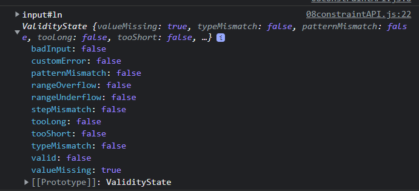

https://developer.mozilla.org/zh-CN/docs/Learn/Forms/Form_validation
# 1 总览

```js
(function init() {
	"use strict";

	let form = document.forms[0];
	console.log(form);
	//form.setAttribute("novalidate", true);
	//console.log(form.attributes);
	console.log('---------');


	// senden unterdrücken, um die Konsole zu lesen
	let submit = document.querySelector("[type=submit]");
	submit.addEventListener("click",
		function (e) {
			e.preventDefault();
		},
		false);


	// Validity anzeigen lassen, für die Textfelder
	/* Fields[i].validity 
		- 包含若干项, 每一项 都有自己的 true false
		- 只有所有项都 都为 ture, 才能得到  Fields[i].valid  为 ture 
		- 注意 这里不是 Fields[i].validity 为 true .  Fields[i].validity  为 一个 collection,  Fields[i].validity  本身不是 boolean value  
	*/

	let fields = document.querySelectorAll("[type=text]");
	for (let i = 0; i < fields.length; i++) {
		console.log(fields[i], fields[i].validity);
	}

	// alternativ
	fields.forEach(field => {
		console.log(field, field.validity);
	});

	console.clear();


	// validity auf Verlassen des Feldes prüfen
	// Das blur-event wird an alle Kinder der form gegeben. 就是说 在某个 fled 输入了 xx的时候, 但是 validlity 的检测不光发生在这个 feld, form[0] 下面 所有的 可以被检测的项目 的检测信息都会被 显示出来
	// Um das Top-Down zu machen, wird die Propagation Reihenfolge umgekehrt.
	// Auf diese Weise braucht man sich nicht alle Felder in Variablen zu speichern.
	form.addEventListener("blur",
		function (e) {
			console.log(e.target);
			let error = e.target.validity;
			console.log(error);
			console.log(error.valid);

			if (error) {
				//Fehlermeldung schicken und Feld übergeben
				console.log(hasError(e.target));
			}
			if (error.valid) // 当全部的 feld 检验都正确了 
				deleteMessage();  // 这是一个自定义的function 
		},
		// propagation umkehren
		true);

	function hasError(field) {
		// nur für Eingabefelder ausführen
		if (field.type === "reset" || field.type === "submit") return;

		let validity = field.validity;
		if (validity.valid) return;

		// an der Konsole testen, danach auskommentierten
		// if(validity.valueMissing) return "Bitte ausfüllen!";
		// if(validity.tooShort) return "Zu wenige Zeichen!";
		// if(validity.rangeUnderflow) return "Du bist zu jung!";

		if (validity.valueMissing) showMessage(field, "fehlt");
		if (validity.tooShort) showMessage(field, "ist zu kurz");
		if (validity.rangeUnderflow) showMessage(field, "ist zu jung");

	};

	function showMessage(field, explanation) {
		// Falls messages vorhanden sind, werden diese vorher gelöscht
		deleteMessage();
		let message = document.createElement("p");
		let text = field.parentElement.firstElementChild.innerHTML + " " + explanation + "!";
		console.log(text);
		message.appendChild(document.createTextNode(text));
		form.appendChild(message);
	};

	function deleteMessage() {
		while (form.lastElementChild.nodeName === "P") {
			form.lastElementChild.remove();
		}
	}

	console.clear();


	/* form data 
	hierfür müssen die Eingabefelder das name-Attribut besitzen!
	*/
	//let formData = new FormData(form);
	//console.log(formData);

	submit.addEventListener("click", (e) => {
		e.preventDefault();
		new FormData(form);  // 点下 submit 这个按钮, 会根据 form 这个变量中内容,产生一个新的 FormData类型 的 对象. form 在上面被 定义的:  let form = document.forms[0];
	}, false);

	// Vor dem Absenden wäre es sinnvoll nochmals auf die validity aller Felder zu prüfen.
	form.addEventListener("formdata", (e) => {
		// formdata 这个event 的意思是, 如果 form 中有 formdata 类型的 对象 被产生的话,就执行后面定义的 function 

		console.log("formdata fired");


		console.log(e.formData);  // 如果只是打印e.formData, 则根据显示的结果 e.formData中没有任何表单上 user 自己输入的信息

		let data = e.formData;
		//console.log(data.entries()); // 如果只是打印data.entries(), 显示的结果是, data.entries()中没有任何表单上 user 自己输入的信息

		console.log("-----------------");
		for (let value of data.entries()) {
			console.log(value);  // 打印的结果是, 这种形式 是可以显示 表单上 user 自己输入的信息
		}

	}, false);


})();
```

# 2 Attribute validity

```js
// Validity anzeigen lassen, für die Textfelder
let fields = document.querySelectorAll("[type=text]");
for (let i = 0; i < fields.length; i++) {
    console.log(fields[i], fields[i].validity);
}


// alternativ
fields.forEach(field => {
    console.log(field, field.validity);
});
```


Fields[i].validity 
- 包含若干项, 每一项 都有自己的 true false
- 只有所有项都 都为 ture, 才能得到  Fields[i].valid  为 ture 
    - 注意 这里不是 Fields[i].validity 为 true .   Fields[i].validity  为 一个 collection,  Fields[i].validity  本身不是 boolean value 
- 
Fields[i].validity.valid
- Fields[i].validity  下其中一项为 Fields[i].validity.valid
- 值为 True oder false 
