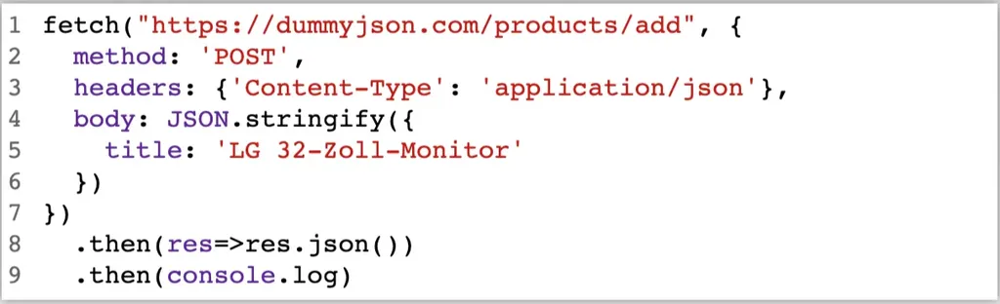
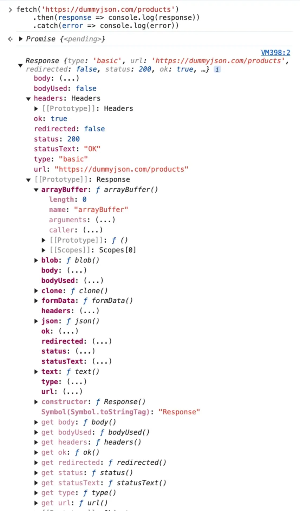
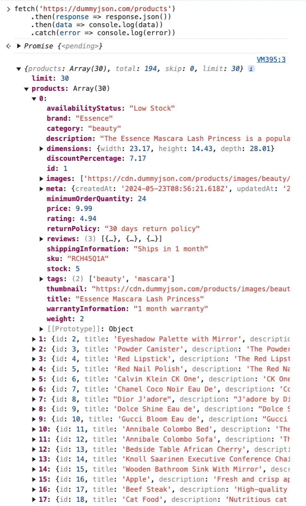

# 1 fetchAPI

https://developer.mozilla.org/en-US/docs/Web/API/Fetch_API/Using_Fetch

Die Fetch-API ist der Nachfolger zu AJAX und dient dem asynchronen Nachladen von Webseitenelementen, auch Code. Eine Anwendung, die fetchdata.txt nachlädt:

Die fetch-Funktion ist eine moderne JavaScript-API, die verwendet wird, um Netzwerk-Anfragen zu senden und Daten von einem Server abzurufen. Sie ist Teil der Web-API und wird häufig für asynchrone HTTP-Anfragen wie GET, POST, PUT oder DELETE verwendet.

Eigenschaften von fetch
- Promises-basiert: Es arbeitet mit Promises, was die Arbeit mit asynchronem Code einfach und übersichtlich macht.
- Nicht blockierend: Es blockiert den Hauptthread nicht, sodass die Benutzeroberfläche reibungslos bleibt. 

## 1.1 Syntax and fetch with chained promises 


XMLHttpRequest
```js
let xhr=new XMLHttpRequest();
xhr.open("GET", "https://dummyjson.com/products", true);

xhr.onload=function() {
  console.log(JSON.parse(xhr.response));
};

xhr.onerror=function() {
  console.error("Netzwerkfehler");
};

xhr.send();
```


fetch

```js
fetch(url, options)
  .then(response => {
    // Umgang mit der Antwort
  })
  .catch(error => {
    // Fehlerbehandlung
  })
  .finally(() => {
    // ausgeführt unabhängig vom Erfolg oder Misserfolg der Operation
	});
```


```js
fetch("https://dummyjson.com/products")
  .then(response=>{
    if (response.status==200) 
      console.log(response.json())
  })
  .catch(()=>console.log("Netzwerkfehler"));


fetch('./fetchdata.txt')
    .then(response => response.json())
    .then(data => {
        console.log(data) // Druckt Ergebnis von `response.json()` in
        getRequest
    })
    .catch(error => console.error(error))

fetch("https://dummyjson.com/products")
  .then(response=>response.json())
  .then(data=>console.log(data))
  .catch(()=>console.log("Netzwerkfehler"));

fetch('https://dummyjson.com/posts')
    .then(response => response.json())                 // Antwort parsen
    .then(data => console.log(data))                   // Daten verwenden
    .catch(error => console.error("Fehler:", error));  // Fehler behandeln


```


- `fetch` API als moderne Alternative zu `XMLHttpRequest`
- Basiert auf Promises.
    - fetch is Promises funtion 
- `fetch`-Methode wird aufgerufen mit
    - einer URL oder
    - einer URL und einem Objekt, welches HTTP-Methode, headers, body der Anfrage und weitere Parameter spezifiziert oder
    - einem Request-Objekt
- **`fetch("https://dummyjson.com/products")`**:
    - Sends an HTTP GET request to the provided URL to fetch data from the API.
    - url: Die URL der Ressource, die abgerufen werden soll.
    - options: Ein Objekt, das weitere Einstellungen wie die Methode, Header und Body enthält. (optional)
        - 
- **`fetch() 的 Rückgabewert: 
    - fetch gibt ein Promise zurück, das entweder:
        - aufgelöst wird, wenn die Antwort vom Server kommt.
        - abgelehnt wird, wenn ein Netzwerkfehler auftritt.


Chained Promises
- Mit Chained Promises kann eine HTTP-Antwort in mehreren asynchronen Schritten bearbeitet werden
- Umwandlung der im Body der HTTP-Antwort enthaltenen Daten im JSON-Format mittels der Methode json() auf response (asynchron)
- Hinweis: im Gegensatz zu JSON.parse() arbeitet response.json() asynchron
- Danach Ausgabe des JSON-Objektes


- HTTP-Antwort wird dann von der an `**then**` übergebenen Funktion abgefangen und ausgewertet
    - then ist ein alternativer Weg, ein Promise asynchron einzulösen (zu evaluieren) und fortzufahren, sobald das Ergebnis geliefert wird. Mit catch() wird im Fehlerfall verzweigt. Bald mehr dazu im Kapitel zu AJAX.
- **`.then(response => response.json())`**:
    - res.json  的作用的是 等候 所有的 response geladen 
    - The `fetch` API returns a `Response` object. Here, `response.json()` extracts the JSON body content from the response.
    - Die Methode `.json()` wird häufig mit der `fetch`-API verwendet, um den Body einer HTTP-Antwort in ein JavaScript-Objekt umzuwandeln. Sie analysiert den JSON-Text der Antwort und gibt ein Promise zurück, das das geparste Objekt enthält.
- **`.then(data => console.log(data))`**:
    - Once the JSON data is parsed, it logs the resulting JavaScript object (`data`) to the console.
- Netzwerkfehler werden den an `**catch**` übergebenen Funktion behandelt
    - **`.catch(() => console.log("Netzwerkfehler"))`**:
        - Handles any errors that occur during the fetch operation, such as network issues or a failed request.
        - Logs `"Netzwerkfehler"` (German for "network error") to the console in case of an error.

## 1.2 Json

JSON (JavaScript Object Notation) ist ein leichtgewichtiges Datenformat, das zum Austausch von Daten zwischen Systemen verwendet wird. Es basiert auf einer einfachen, textbasierten Struktur und ist leicht lesbar für Menschen und Maschinen. JSON wird in der Webentwicklung beim Datenaustausch zwischen einem Server und einem Client eingesetzt.

Objekte: Eine Sammlung von Schlüssel-Wert-Paaren.
```json
{
  "firstname": "Jane",
  "lastname": "Doe"
  "age": 25,
  "country": "US"
}
```

Arrays: Eine geordnete Liste von Werten.
```json
[
  "Apple",
  "Banana",
  "Orange",
  "Cherry"
]
```


**Beispiel: API-Daten**
*Ein Server könnte folgende JSON-Daten an einen Client senden:*
```json
{
  "benutzer": {
    "id": 123,
    "name": "Max Mustermann",
    "email": "max@example.com"
  },
  "bestellungen": [
    {
      "id": 1,
      "produkt": "Laptop",
      "preis": 1200.99
    },
    {
      "id": 2,
      "produkt": "Maus",
      "preis": 25.5
    }
  ]
}
```

----

Die Methode `.json()`

Die Methode .json() wird mit der fetch-API verwendet, um den Body einer HTTP-Antwort in ein JavaScript-Objekt umzuwandeln. Sie analysiert den JSON-Text der Antwort und gibt ein Promise zurück, das das geparste Objekt enthält.

Unbearbeitetes, nicht geparstes Response-Objekt liefert nur einen “blöden Quatsch”, mit dem man “nichts” anfangen kann


Das durch .json-Methode bearbeitete JavaScript-Objekt, das reelle Daten in Key-Value-Pairs gespeichert aufbewahrt



## 1.3 Anpassung von fetch (I/II)

在 fetch 中使用 specific  request message 

- fetch kann mit einem zweiten Argument, neben der URL, angepasst werden
    - Spezifikation der HTTP-Methode
    - Definition von HTTP-Headers (Achtung: nicht alles Headers sind aus Sicherheitsgründen erlaubt)
    - Spezifikation des HTTP-Body
    - Weitere Parameter, siehe fetch API
- Alternativ können fetch-Argumente mit einem Request-Konstruktor spezifiziert werden


fetch
```js
fetch("https://dummyjson.com/products/add", {
  method: 'POST',
  headers: {'Content-Type': 'application/json'},
  body: JSON.stringify({
    title: 'LG 32-Zoll-Monitor'
  })
})
  .then(res=>res.json())
  .then(console.log)
```

Request
```js
let req=new Request("https://dummyjson.com/products/add", {
  method: 'POST',
  headers: {'Content-Type': 'application/json'},
  body: JSON.stringify({
    title: 'LG 32-Zoll-Monitor'
  })
});

fetch(req)
  .then(res=>res.json())
  .then(console.log);
```


# 2 Polling
隔一阵子 就问一下 server 端

```js
setInterval(()=>{
  fetch("https://dummyjson.com/products")
    .then((response)=>response.json())
    .then(console.log)
}, 1000);
```

- Hoher Bedarf an Webanwendungen mit Push-Funktionalität: Chat, Alarme, Collaborative Office-Umgebungen, etc.
- Problem: Server kann keine Verbindungen zum Client aufbauen


- Wiederholtes Aufrufen der `**send()**`-Methode in regelmäßigen Abständen von **t** ms
- Nach Erhalt jeder Anfrage prüft der Server ob seit der letzten Anfrage eine Datenaktualisierung aufgetreten ist
- Wenn ja, sendet Server die Daten zum Client
- Wenn nein, wird leere Antwort gesendet
- Steuerung durch `**setInterval()**`-Funktion


## 2.1 Long Polling

```
function longPolling() {
  fetch("https://dummyjson.com/products")
    .then((response)=>response.json())
    .then(console.log)
    .then(()=>longPolling())
};

longPolling();
```


- Problem von Polling: Tradeoff zwischen dem Aufwand für den Austausch von HTTP-Anfragen und Antworten und der zeitnahen Zustellung von Datenaktualisierungen
- Reduzierung der Aufwands durch Vergrößerung des Anfrageintervalls führt zu verzögerter Zustellung von Daten
- Geringe Verzögerung führt zu häufigen Anfrage/Antwort-Zyklen


Long Polling
- Serverseitige Implementierung des Timeouts
- ==Server beantwortet eine HTTP-Anfrage nicht bis eine Datenaktualisierung oder ein Timeout eintritt==
    - server 收到 http-Anfrage, 在time out 时间内, 如果没有 Datenaktualisierung, 则一直不发出 reponse 给 server. 等到 time out 发生 , 在发送 http response 
    - 在time out 时间内, 如果有 Datenaktualisierung, 则不等到 time out 发生 , 就马上发送  http response 给 clisent 
- Bei Datenaktualisierung wird Antwort mit aktualisierten Daten gesendet
- Nach Eintreffen der Antwort initiiert der Client sofort eine neue HTTP-Anfrage
    - Client收到 任何 http repsonse 就马上在发送一个新的 http anfrage 
- Client und Server verfügen über eine quasi permanent andauernde Verbindung


